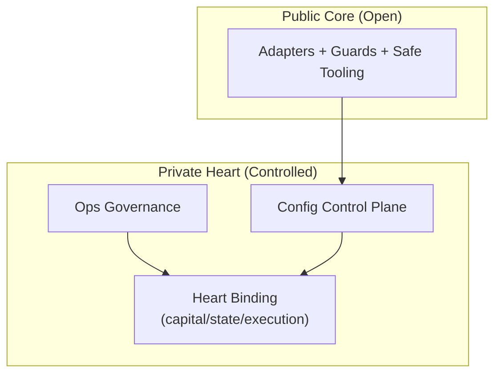

# Universal Exchange Adapters (Public Core)

**Exchange-agnostic adapter architecture for survivable crypto trading systems.**  
This project exists because I did not want to get wiped out.

After real operational failures (exchange shutdowns, API changes, regional restrictions),
I learned that **survivability matters more than profits**.

This repository provides a minimal **public core**:

- Fixed exchange adapter interface
- Safe market-data helpers
- Dry-run smoke tools
- Risk scanning foundation

> ⚠️ This is not a strategy.  
> This is infrastructure for not dying first.

---

## Philosophy

- You don’t need to win every day  
- You must survive the year  
- Exchanges can disappear, restrict regions, or change APIs  
- Trading logic should never depend directly on exchange APIs  
- Trading and Treasury (withdrawal) must be separated  
- Maximum Drawdown is a hard constraint, not a parameter  

This is not about “how to get rich”.  
This is about not dying first.

---

## Wind / Forest / Fire / Mountain / Shadow Doctrine

This system strictly separates information, decision, and execution:

- **Wind (BTC)** — market direction & volatility observer  
- **Forest (Workers)** — executes predefined actions without discretion  
- **Fire (BCH)** — anomaly ignition detector  
- **Mountain (Supervisor)** — final mechanical decision-maker  
- **Shadow (Intelligence)** — gathers signals but never acts  

The Forest never decides.  
The Shadow never acts.  
The Mountain never guesses.

---

## What This Repository Is

✅ A fixed adapter interface for crypto exchanges  
✅ Defensive architecture against:

- API changes  
- exchange exits  
- region bans  
- operational mistakes  

✅ Extendable foundation for:

- Bybit  
- MEXC  
- Binance (planned)  
- Bitget (planned)

---

## Supported Exchanges (Public Proof / NO-EXEC)

UEH publishes **market-data proof demos only** in the public core repository.
No execution modules are included.

**Public proof demos:**

- Bybit — market-data demo (NO-EXEC)
- bitFlyer (Japan) — market-data demo (NO-EXEC)
- MEXC (Global) — market-data demo (NO-EXEC)
- Binance (Japan) — market-data demo (NO-EXEC)
- Coincheck (Japan) — market-data demo (NO-EXEC)
- OKCoin Japan — market-data demo (NO-EXEC)
- Bitget — ticker-only proof (NO-EXEC)

**Docs & References:**

- Japan Exchange Ready: `docs/japan.html`
- Whitepaper (Austere PDF): `docs/UEH_Whitepaper_Austere.pdf`

**Commercial boundary:**

- Private delivery includes constraints packs + ops templates under controlled terms.
- Delivery begins only after Boundary Acknowledgement + Payment Confirmation.
- Contact: ueh.enterprise@gmail.com

---

## What This Repository Is NOT

❌ A trading strategy  
❌ A profit guarantee  
❌ Investment advice  
❌ A ready-to-use money machine  
❌ A place for API keys or secrets  

If you are looking for a “copy & profit bot”, this is not for you.

---

## Core Design

### Adapter Pattern (Fixed Interface)

Your trading system talks only to:

- `TradingAdapter` (no withdrawal capability)
- `TreasuryAdapter` (withdrawal only, stronger guards)

If an exchange dies, you replace the adapter — not the system.

---

## Safe Tools Included (Dry-Run)

This public core ships with defensive operational tools:

### Smoke Execution Test (dry-run only)

```bash
PYTHONPATH=. python tools/order_smoke_test.py

## Private Heart (Controlled)

This public repository is intentionally limited to a survivability interface layer.

Operational responsibility layers are kept private by design:
- Ops governance (shutdown / recovery / monitoring / incident discipline)
- Control-plane configuration schemas (structural, not tuned defaults)
- Heart components binding capital, state, and execution authority

This separation exists to prevent context collapse and unsafe replication.
No performance or profitability claims are made.

### System Map (High-level)



Operational responsibility layers are intentionally distributed in controlled form.
If you are an operator seeking survivability governance materials (Ops/Config packs),
contact: ueh.enterprise@gmail.com — access is exception-based and refusal requires no justification.

---

See: `TECHNICAL_BRIEF.md` for a survivability-first overview.
